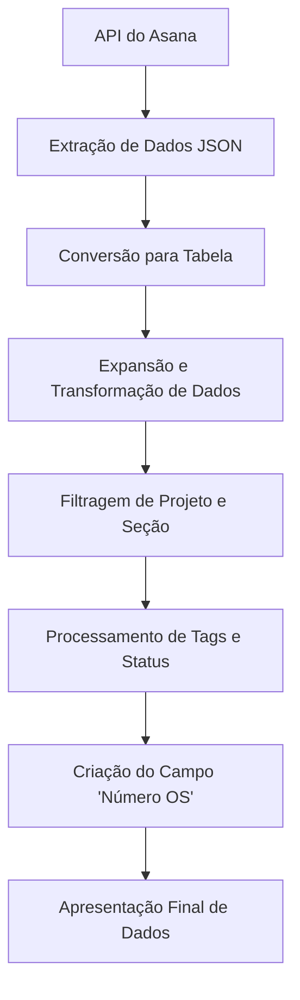

# 📚 **Documentação do Código: Integração e Processamento de Dados da API Asana**

---

## 📖 **1. Visão Geral**

Este código tem como objetivo:
- Conectar-se à API do **Asana** e extrair dados de tarefas de um projeto específico.
- Processar, transformar e apresentar esses dados de forma organizada para análise no **Power BI**.
- Exibir informações detalhadas, como:

    - Nome da tarefa
    - Responsável
    - Status
    - Projetos
    - Seções
    - Datas relevantes
    - Tags associadas

Além disso, o código gera automaticamente um campo **"Número OS"**, extraído de tags contendo a string "OS".

---

## ⚙️ **2. Requisitos**

### 🔑 **Tecnologias:**
- **Power BI Desktop** (versão atualizada)
- **Power Query**

### 🔐 **Credenciais e Permissões:**
- **Token de Acesso (AccessToken)** válido para a API do Asana.
- **GID do Projeto (IdProjeto)** para o qual as tarefas serão extraídas.

### 🏗 **Permissões API:**
- Leitura de tarefas, projetos, membros, seções, datas e tags.

---

## 🧭 **3. Fluxo do Processo**

**Diagrama Complementar:**
- Representa o fluxo de dados desde a extração na API até a apresentação final no Power BI.

---

## 🔍 **4. Descrição Detalhada das Etapas**

### **🔗 Conexão com a API:**
- **IdProjeto:** Identificador único do projeto Asana.
- **AccessToken:** Token de acesso para autenticação.
- **Fonte:** Faz a requisição via `Web.Contents` e converte o JSON em um documento processável.

### **🔄 Transformações Iniciais:**
- **ConverterParaTabela:** Converte o JSON em uma tabela.
- **ExpandirColunasLista:** Expande a lista de tarefas.
- **ExpandirColunasRecord:** Detalha as colunas de cada tarefa.

### **🧩 Expansão de Colunas Relacionadas:**
- **ExpandirResponsável:** Exibe o nome do responsável.
- **ExpandirConcluidoPor:** Exibe quem concluiu a tarefa.
- **ExpandirCriadoPor:** Exibe o criador da tarefa.
- **ExpandirMemberships:** Expande associações de projetos e seções.

### **📂 Filtragem e Organização:**
- **FiltrarSeçõesPorProjeto:** Filtra dados do projeto específico.
- **RemoverColunaProjectMembership:** Remove identificadores redundantes.
- **ExpandirNomeProjeto:** Exibe o nome do projeto.

### **📅 Tratamento de Datas:**
- **TiposColunasDatas:** Converte campos de data para tipos adequados.
- **AddColunaStatus:** Gera status "Concluído" ou "Em Andamento" com base na data de conclusão da tarefa principal.

### **🏷 Processamento e Agrupamento de Tags:**
- **ExpandirColunaListaTag:** Expande listas de tags.
- **TagsAgrupadas:** Agrupa e concatena tags em uma única string.

### **🔧 Ajustes e Limpeza de Dados:**
- **SubstituirValores:** Substitui variações indesejadas em tags.
- **AddColunaOSTag:** Extrai números de ordens de serviço (OS) de tags específicas.
- **ReordenarColunas:** Organiza a apresentação final das colunas.

---

## 📊 **5. Estrutura dos Dados**

### **📥 Entrada (API Asana):**
- **created_at** (datetime) - Data de criação da tarefa.
- **completed_at** (datetime) - Data de conclusão da tarefa.
- **due_on** (date) - Data prevista para conclusão, definida pelo usuário no Asana.
- **assignee.name** (text) - Nome do responsável.
- **permalink_url** (text) - Link da tarefa no Asana.
- **tags.name** (list) - Lista de tags associadas.
- **memberships.section.name** (text) - Nome da seção da tarefa.

### **📤 Saída (Apresentação Final):**
- **Data de Criação** | **Data de Conclusão** | **Previsão de Conclusão**
- **Responsável** | **Tarefa** | **Projeto** | **Status**
- **Número OS** (gerada automaticamente) | **Tags** | **Link da Tarefa** | **Seção**

---

## 🧪 **6. Exemplos de Uso**

### **🔨 Cenário 1: Verificar Tarefas Concluídas**
> Filtrar a coluna **Status** = "Concluído" para análise de produtividade.

### **🔨 Cenário 2: Identificar Ordens de Serviço**
> Usar o campo **Número OS** para identificar e analisar ordens de serviço automaticamente extraídas.

### **🔨 Cenário 3: Análise por Seção**
> Criar gráficos e relatórios categorizando tarefas por **Seção** e **Status**.

---

## 💬 **7. Considerações Finais**

- 🔒 **Segurança:** Tokens de acesso devem ser protegidos e atualizados regularmente.
- 🔄 **Manutenção:** Monitorar alterações na API do Asana que possam impactar o `opt_fields`.
- ⚡ **Desempenho:** Revisar transformações caso o volume de dados aumente significativamente.

---